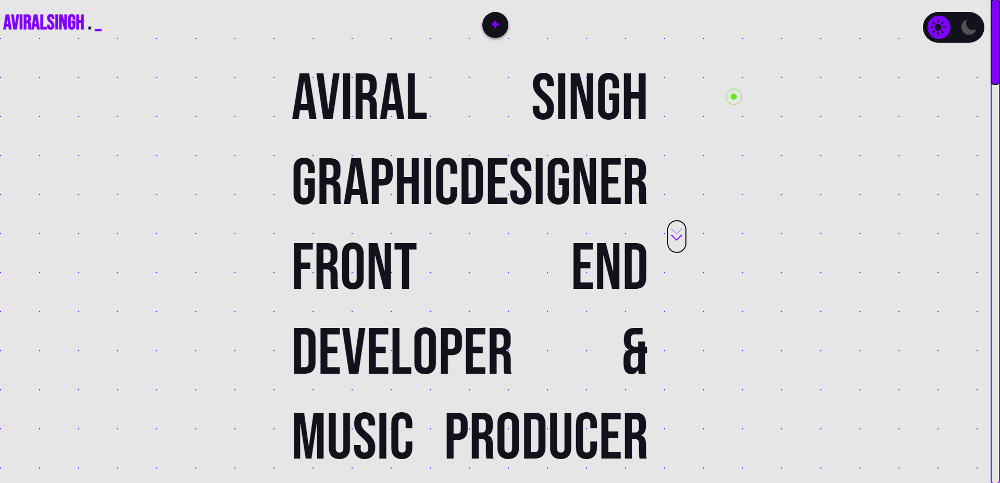
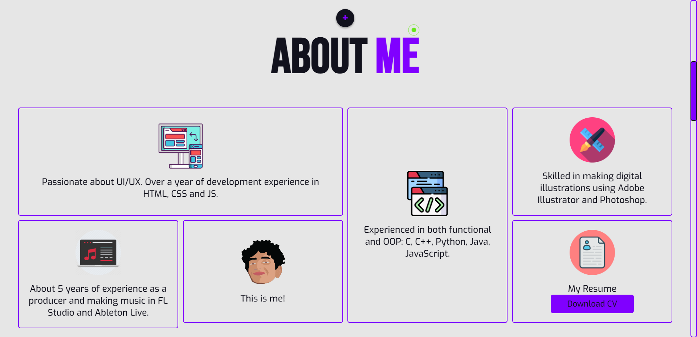
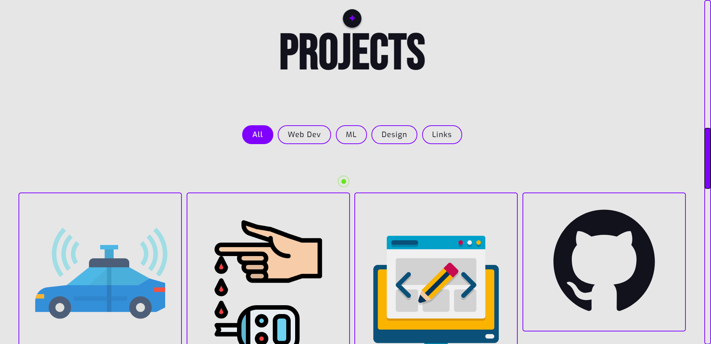
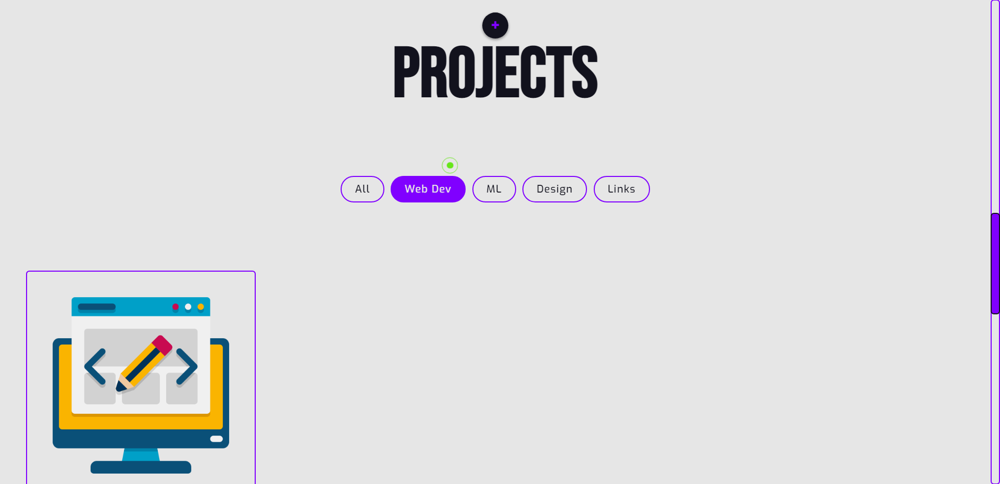
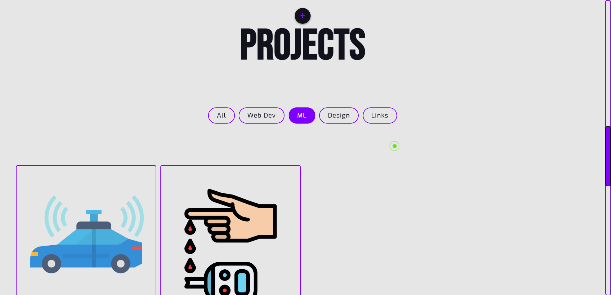
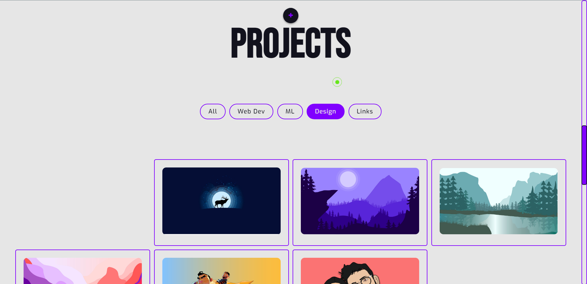
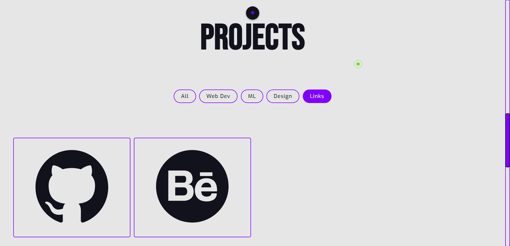
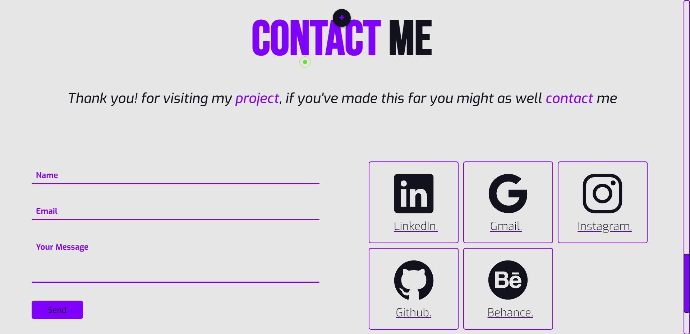
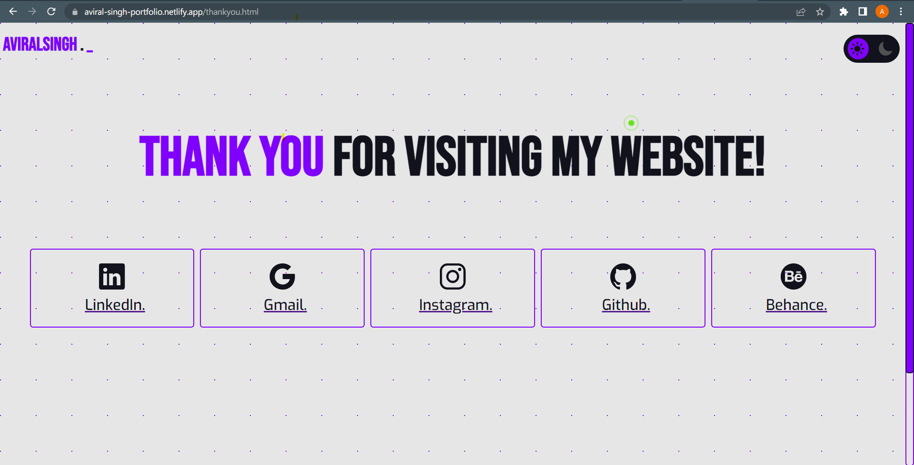
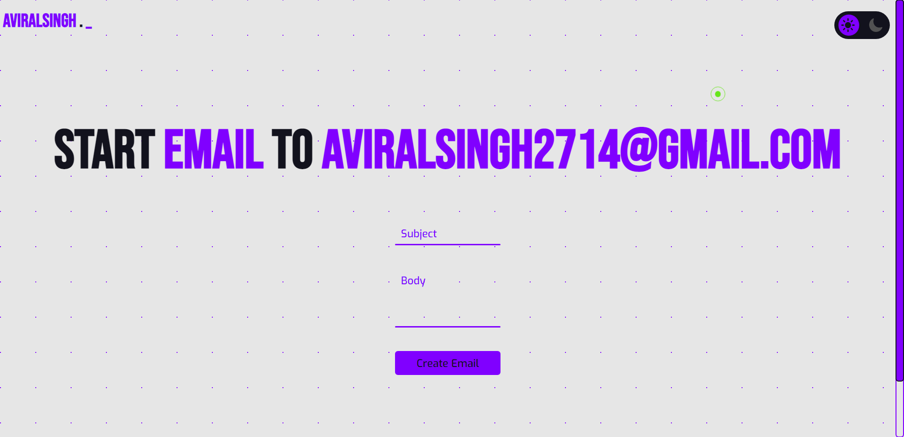

# Personal-Portfolio-Website
This is a responsive personal portfolio website, made using HTML, CSS and Java-Script. 

<h3><b>To make the contact form work</b></h3>

* Pointing the action-attribute of your form to https://formsubmit.co/ URL will enable submissions to be sent to your email address.  
* Use form action as "https://formsubmit.co/your@email.com" and method as Post.  
* You can add various basic and advanced form attributes according your needs you can learn more about it @ https://formsubmit.co/.  
* Lastly submit the form once. This first-time-use will trigger an email requesting confirmation. After that you're good to go.  

<h3><b>Contact Form Example</b></h3>

Steps

Advanced Features

 

# Main-Website (Light-Mode)
<h3><b>Home Page</b></h3>

<h3><b>About Me Page</b></h3>

<h3><b>Projects Page</b></h3>

<h3><b>Contact Me Page</b></h3>

# ThabkYou-Website (Light-Mode)

# MailMe-Website (Light-Mode)

